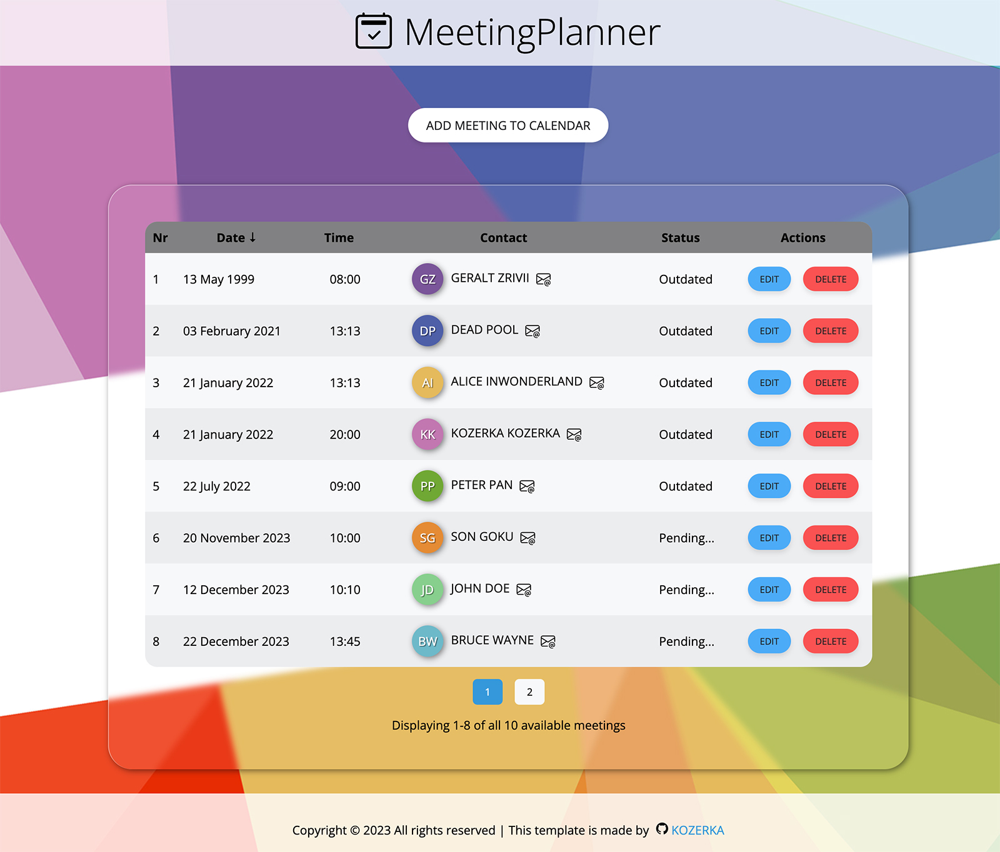

# MeetingPlanner

🚀 **Overview**

MeetingPlanner is a appointment scheduling application. Through its intuitive and modern interface, users can seamlessly manage their appointments and ensure punctuality in their daily tasks.
<p align="center">
  
</p>


## Technology Stack

    

🖥 **Features**

- **Easy Data Input**: Quickly capture crucial meeting details such as date, time, first name, last name, and email through a user-friendly form.
- **Data Storage**: All meetings are stored in a `.json` file, making data retrieval effortless even when offline.
- **Modular Components**: The app’s architecture revolves around component-based designs. This not only ensures seamless updates in the future but also provides an efficient data flow through `state` and `props`.
- **Validation**: Every input is rigorously validated, ensuring the consistency and accuracy of the data.
- **Sorting Features**: Organize your meetings efficiently! Now sort columns by date, time, status, and name.
- **Unique User Avatars**: Every user gets a distinct avatar next to their name, enhancing recognition.
- **Meeting Management**:
  - **Status Indicators**: Past meetings are marked 'outdated', while upcoming ones are labeled 'pending'. Moreover, meetings can be sorted by their status for quick accessibility.
  - **Safety Precautions**: Prior to deleting any meeting data, users will encounter a confirmation step, minimizing the risk of accidental data loss.
  - **Time Adjustments**: Flexibly edit both the date and time of scheduled meetings.
- **Redux Management**: The entire app benefits from Redux's powerful state management capabilities. With the use of `connect()`, maintaining and accessing state across components has never been easier.


🛠 **Set-Up**

The project uses [node](https://nodejs.org/en/), [npm](https://www.npmjs.com/) and [JSON server](https://www.npmjs.com/package/json-server), follow the steps below to run it locally.

- Clone the project using

```bash
  git clone
```

- Go to the project directory and install dependencies

```bash
  npm i
```

- Start developers mode

```bash
  npm start
```
- Install JSON server 

```bash
  npm i json-server
```
- Start JSON server

```bash
  npm run start:server
```

🔗 **Related Resources**
- [Create React App Documentation](https://reactjs.org/docs/create-a-new-react-app.html)
- [JSON Server](https://github.com/typicode/json-server)

## License
This project is made available under the MIT license. More details can be found in the LICENSE file in the main directory of the repository.

&nbsp;

## 🙏 Special thanks

Special thanks to my [Mentor - devmentor.pl](https://devmentor.pl/) for providing me with the task.